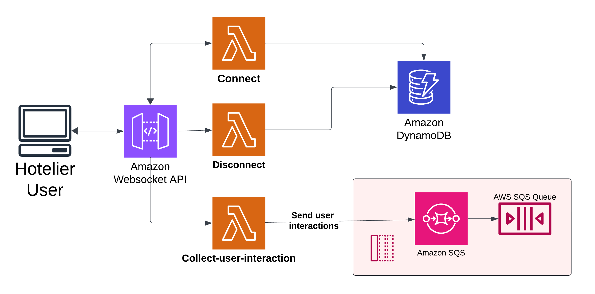
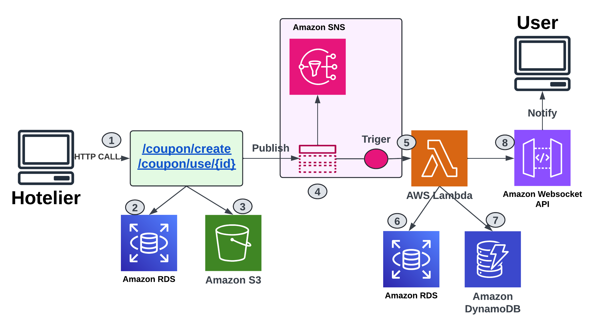
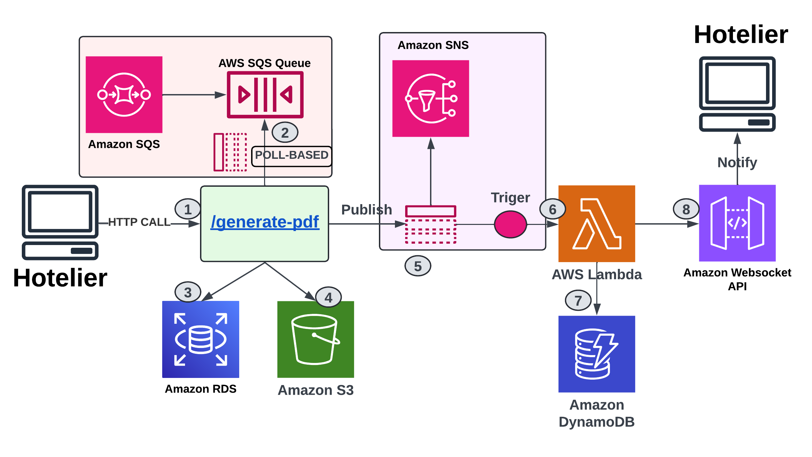

# 🏨 Hotel Coupon App

**Hotel Coupon App** is a cloud-native platform that enables hoteliers to create, manage, and distribute discount coupons in real time, while users can search, redeem, and receive instant notifications.  
The project leverages **serverless** and **event-driven architectures** on AWS, combining **Angular**, **Django REST API**, **AWS Lambdas**, and a **custom Python PDF reporting library**.

---

## 📂 Repositories

- 🌐 [**Angular GUI**](https://github.com/alexandermamaniy/ccp-hotel-coupon-frontend) — User and hotelier web interface.  
- ⚙️ [**Django REST-API**](https://github.com/alexandermamaniy/ccp-hotel-coupon-backend) — Backend and main API service.  
- ☁️ [**AWS Lambdas & Deployment**](https://github.com/alexandermamaniy/ccp-hotel-coupon-deploy) — Serverless functions and deployment scripts.  
- 📑 [**Python PDF Report Library**](https://pypi.org/project/hotel-coupon-app-package-alexandermamani/) — Custom library for generating PDF reports.  

📖 [**Full Project Report (PDF)**](https://github.com/alexandermamaniy/hotel-coupon-app/blob/main/document/hotel_coupon_app_document.pdf)

---

## 🚀 Features

### 👤 Users
- Search coupons by title, discount, or hotel name.  
- Redeem coupons and automatically subscribe to future offers from the same hotelier.  
- View redeemed coupons, use them via unique QRcodes, and receive real-time notifications.  

### 🏨 Hoteliers
- Create, edit, and track coupon usage.  
- Notify subscribed users about new coupons instantly.  
- Generate PDF reports with insights into coupon performance and user interactions.  

---

## ⚡ Architecture

The system combines **AWS Serverless** and **Event-Driven Design**:

- **Amazon S3** → Store images & reports.  
- **Amazon RDS (PostgreSQL)** → Business data storage.  
- **Amazon DynamoDB** → Manage WebSocket connections.  
- **Amazon SNS** → Real-time publish/subscribe notifications.  
- **Amazon SQS** → Batch processing of user interactions.  
- **AWS Lambda** → Serverless execution of tasks.  
- **Amazon API Gateway (WebSockets)** → Real-time communication.  

### Capture of User Interactions
Due to the large volume of user interactions—such as viewing and redeeming coupons—that a single user can generate in one session, and the need to store and later dispose of this data, the system uses SQS for batch processing. The WebSocket API is used to send data continuously, while DynamoDB stores WebSocket connection sessions as users log in to the system.

### Create and Use Coupons
Creating and using coupons involves several tasks, including storing them in a database and file system, and notifying all users subscribed to the hotelier who owns the coupon. Coupon data is stored in RDS, multimedia files like images are stored in S3, and SNS is used to publish notifications once a coupon is created or used. When a message is sent, a Lambda function is triggered to query RDS for subscribed users, find their WebSocket connections in DynamoDB, and notify all relevant users.

### Generate Reports
Report generation is the most complex feature due to the challenges of batch processing. SQS is used to poll and process user interaction data, filtering it for each hotelier. First, the hotelier sends an HTTP request to the Django REST API service. Then, user interaction data is processed, and a PDF report is generated and stored in RDS and S3. Once the report is ready, a message is published to an SNS topic to notify the hotelier. Since data processing can take time, SNS and WebSocket notifications are ideal for handling these asynchronous requests.

### Circuit Breaker
To improve system reliability, the Circuit Breaker pattern is implemented for the QR Code REST API. User requests go through Amazon API Gateway to a Lambda function, which checks the recent error count in DynamoDB. If the error count is within acceptable limits, the request is forwarded to the QR Code service. If it fails, the error is logged in DynamoDB with a time limit and sent to EventBridge. When the error count exceeds the limit, new requests are blocked to prevent overload and keep the app running. 

---

## 🛠️ CI/CD Workflow

The project uses **GitHub Actions + Docker + AWS**:

1. **CI (Continuous Integration)**  
   - Build containers for each repo.  
   - Run automated tests.  
   - Push images to Docker Registry.  

2. **CD (Continuous Delivery & Deployment)**  
   - `staging/***` branches for feature releases.  
   - `main` branch for production deployments.  
   - Deployment on **AWS EC2** with **Docker Compose**.

---
